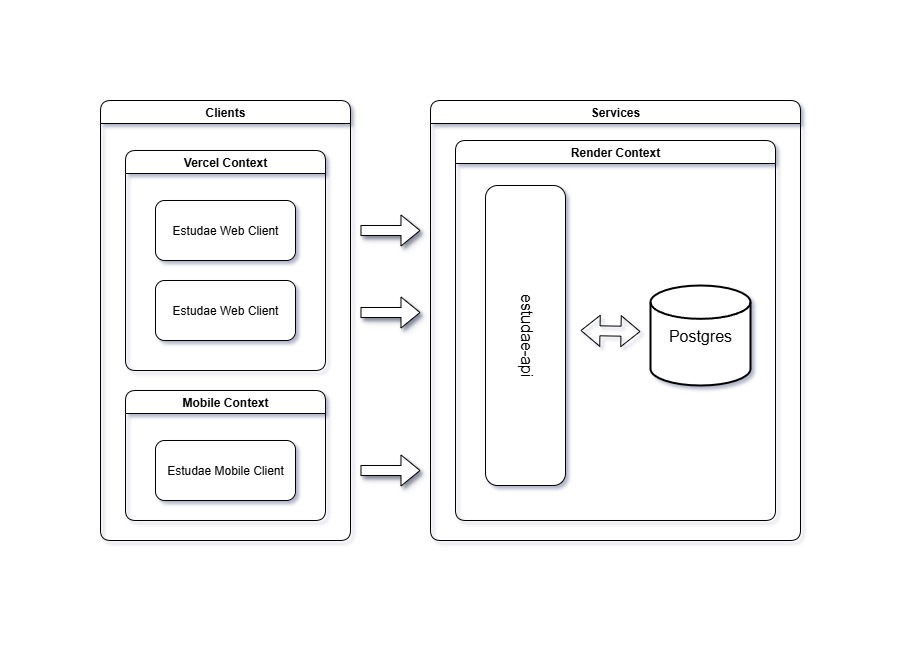

# Arquitetura

## Modelo e diagrama

O modelo de arquitetura escolhido foi o monolítico, pois não há necessidade de ser implementado algum outro modelo. Caso haja a necessidade de escalar o sistema ou houver alguma adição de componente, o esquema abaixo sofrerá modificações.

Modelo geral de arquitetura do projeto:

## Decisões técnicas

### Front-end

Dentre as opções disponíveis, foi optado pelo ReactJS com TS + Vite pois ele oferece um início de desenvolvimento muito rápido e todos no grupo já mexeram com a ferramenta, tornando ela melhor opção para o desenvolvimento;

### Mobile

Dado que a aplicação front-end WEB será em ReactJS, a melhor escolha para desenvolver o app mobile é usando o React Native, pois irá facilitar muito a manutenção do app.

### Back-end

Assim como a escolha anterior, a opção de NodeJS + Express também proporciona um início de desenvolvimento bem rápido e todos no grupo já utilizaram a ferramenta. Caso seja necessário trocar para uma opção mais solida, o Java + Spring Framework é a opção a ser escolhida.

### Banco de dados

Foi escolhido o PostgreSQL pela confiabilidade de segurança do dados, pelo desempenho para caso de escalabilidade de usuários e pelo controle de concorrência que o banco suporta.

Até o momento não foi escolhido nenhum banco NoSQL pois não há a necessidade do uso.

### Autenticação

O uso do Bcrypt resolve um problema que seria o rápido acesso do usuário. Inicialmente não tem motivos fortes para a implementação de dois fatores, então a implementação do Bcrypt resolve o problema.

### Deploy

- **Front-end:** A Vercel foi escolhida pela facilidade em fazer os deploys e pelo fato de todos os integrantes já terem utilizado, o que torna mais fácil o uso da plataforma;
- **Mobile:** Por enquanto o aplicativo será publicado apenas na Play Store, pois devido ao baixo budget não será possível publicar na Apple Store;
- **Back-end:** Das possíveis escolhas, a plataforma Render se destaca pela facilidade em fazer o deploy e poder acompanhar os logs e pipelines. Caso o sistema venha a escalar muito rápido, a troca para uma plataforma robusta mais robusta como GCP ou AWS é necessária;
- **Banco de dados:** A plataforma Render também tem suporte ao deploy de databases e os motivos do uso dela para isso são os mesmos do back-end. Caso o sistema venha a escalar muito, deve ser seguida a mesma recomendação do deploy da API back-end;
